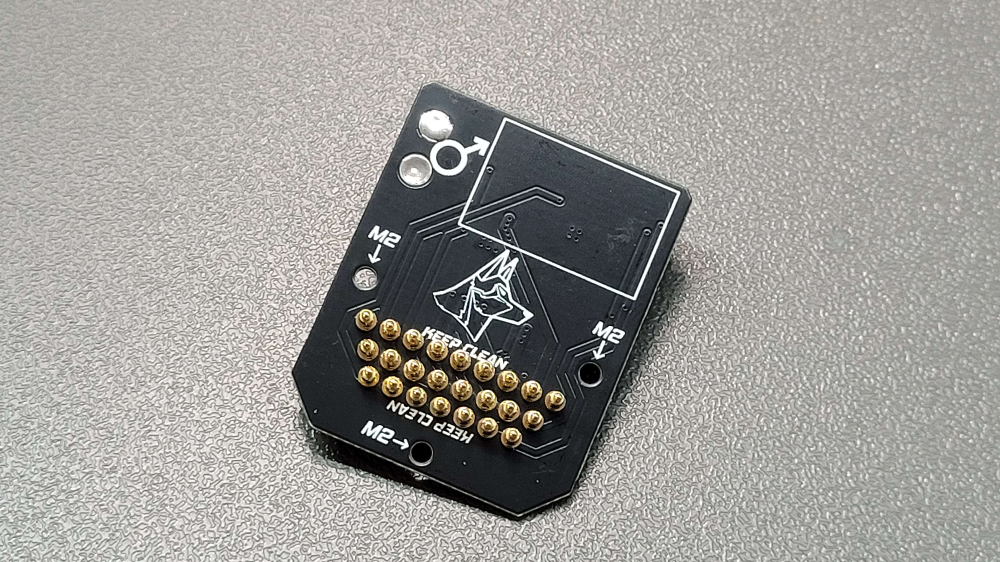

# Payload Connector (Male)

<figure><figcaption></figcaption></figure>

## Gerber Files

### PCB Fab Specifications

|               |        |
| ------------- | ------ |
| PCB Thickness | 1.2 mm |
|               |        |
|               |        |

### Gerber File



## Bills of Material

|   |   |   |
| - | - | - |
|   |   |   |
|   |   |   |
|   |   |   |
